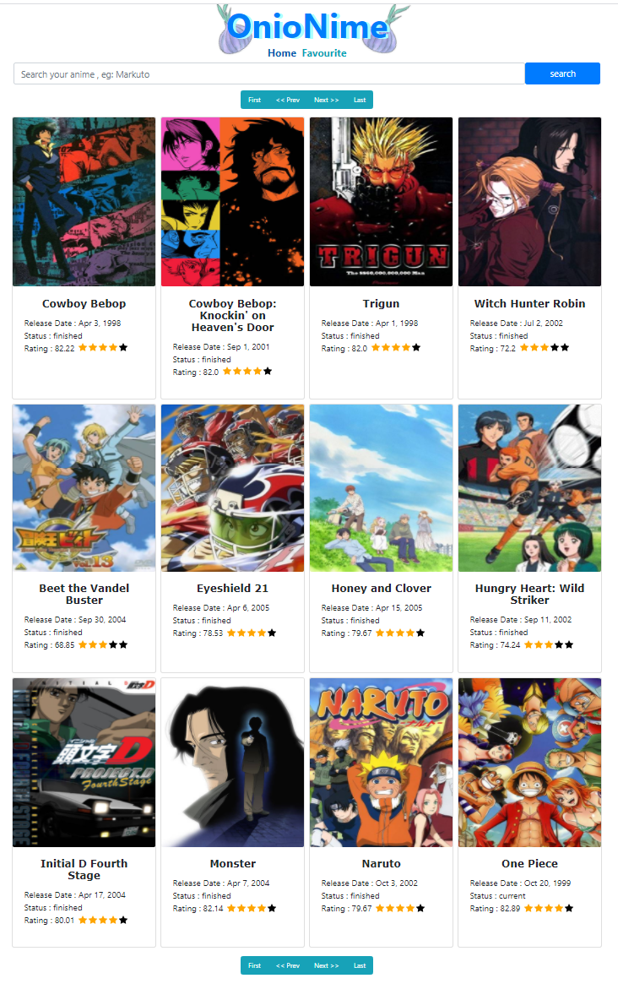
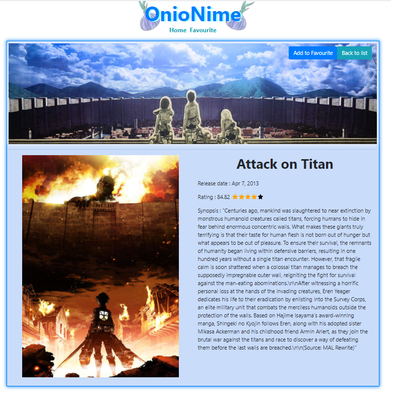

# react-challenge

### Link Deploy : https://onion-nime.web.app/

# Screenshoot

1. Home Page

2. Detail Page

# How to

1. one page show 20 anime(s).
2. each anime have detail and synopsis, you can access it by clicking their poster or title.
3. you can add your favorite anime to my favorite page by click the favorite button.
4. you can access favorite page by clicking "Favorite" button beside of "Home" button.
5. Favorite list is saved on global state, and will be cleared when you refresh the page.